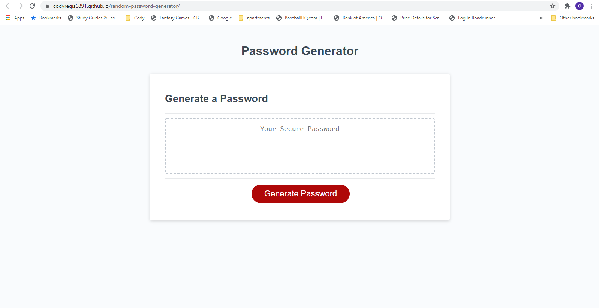

# Random Password Generator

## License

[](https://opensource.org/licenses/MIT)



## Live Application

https://codyregis6891.github.io/random-password-generator/

## Technology Used

* Javascript
* HTML
* CSS


## Description

This is a simple yet effective application that creates a random password that the user can generate to increase their web security.

## Installation

1. Clone the Repo
  ```sh
  git@github.com:codyregis6891/random-password-generator.git
  ```
2. View on your browser via localhost
  ```sh
  Right-click on index.html in VSCode, then click on "Open in Default Browser"
  ```

## Questions or Issues?

* Email: codyregis6891@yahoo.com
* https://github.com/codyregis6891/workday-scheduler/issues
